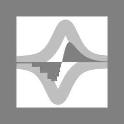

<p align="center">
  
    &nbsp; &nbsp; &nbsp;
  
</p>

# ZL Spectrum Equalizer

[](https://opensource.org/license/agpl-v3)
[](https://somsubhra.github.io/github-release-stats/?username=ZL-Audio&repository=ZLSpectrumEqualizer&page=1&per_page=30)

ZL Spectrum Equalizer is a spectrum equalizer plugin.

## Build from Source

### Install Dependencies

Please make sure `Clang` (`AppleClang 16+` or `LLVM/Clang 17+`), `cmake 3.25+`, `ninja` are installed and configured on your OS.

On Linux, you can install the remaining dependencies with the following command:

```console
sudo apt-get update && sudo apt install libasound2-dev libx11-dev libxcomposite-dev libxcursor-dev libxext-dev libxinerama-dev libxrandr-dev libxrender-dev libfreetype-dev libfontconfig1-dev libxi-dev
```

### Clone and Build

Once you have set up the environment, you can clone the ZL Equalizer code, populate all submodules, then configure & build the code. Please set:

- the variable `ZL_JUCE_FORMATS` as a list of plugin formats that you want, e.g., `"VST3;LV2"`
  - AAX plug-ins need to be digitally signed using PACE Anti-Piracy's signing tools before they will run in commercially available versions of Pro Tools.
- the variable `ZL_EQ_BAND_NUM` as the number of bands, default 24 bands
  - The plugins built with different `ZL_EQ_BAND_NUM` may NOT be compatible with each other.
- the variable `ZL_HWY_STATIC_TARGET` as the SIMD target
  - If you are on x86-64 and your CPU supports SSE2, set `ZL_HWY_STATIC_TARGET=SSE2`.
  - If you are on x86-64 and your CPU supports SSE2/SSE4, set `ZL_HWY_STATIC_TARGET=SSE4`.
  - If you are on x86-64 and your CPU supports SSE2/SSE4/AVX2, set `ZL_HWY_STATIC_TARGET=AVX2`.
  - If you are on arm64, set `ZL_HWY_STATIC_TARGET=NEON`.
- If there are multiple compilers on your OS, you may need to pass extra flags to maker sure that cmake uses `LLVM/Clang`.
  - On Linux, you may pass `-DCMAKE_C_COMPILER=clang -DCMAKE_CXX_COMPILER=clang++`.
  - On Windows, you may pass `-DCMAKE_C_COMPILER=clang-cl -DCMAKE_CXX_COMPILER=clang-cl`.

```console
git clone https://github.com/ZL-Audio/ZLSpectrumEqualizer
cd ZLSpectrumEqualizer
git submodule update --init --recursive
cmake -B Builds -G Ninja -DCMAKE_BUILD_TYPE=Release -DZL_JUCE_FORMATS="VST3;LV2" -DZL_HWY_STATIC_TARGET="NEON" .
cmake --build Builds --config Release
```

After building, the plugins should have been copied to the corresponding folders. If you want to disable the copy process, you can pass `-DZL_JUCE_COPY_PLUGIN=FALSE`, find the binary folders under `Builds/ZLSpectrumEqualizer_artefacts/Release` and copy them manually.

## License

ZL Spectrum Equalizer is licensed under AGPLv3, as found in the [LICENSE.md](LICENSE.md) file. However, the [logo of ZL Audio](assets/zlaudio.svg) and the [logo of ZL Spectrum Equalizer](assets/logo.svg) are not covered by this license.

Copyright (c) 2023-2026 [zsliu98](https://github.com/zsliu98)

JUCE framework from [JUCE](https://github.com/juce-framework/JUCE)

JUCE template from [pamplejuce](https://github.com/sudara/pamplejuce)

[Highway](https://github.com/google/highway) by [Google](https://github.com/google)

[Material Symbols](https://github.com/google/material-design-icons) by [Google](https://github.com/google)

[inter](https://github.com/rsms/inter) by [The Inter Project Authors](https://github.com/rsms/inter)

## References

Dimitrios Giannoulis, Michael Massberg, and Joshua D. Reiss. *Digital dynamic range compressor design—A tutorial and analysis*. Journal of the Audio Engineering Society. (2012).

Nigel Redmon. *Cascading filters*. (2016).

Cleve Moler. [*Makima Piecewise Cubic Interpolation*](https://blogs.mathworks.com/cleve/2019/04/29/makima-piecewise-cubic-interpolation/). MathWorks Blogs. (2019).